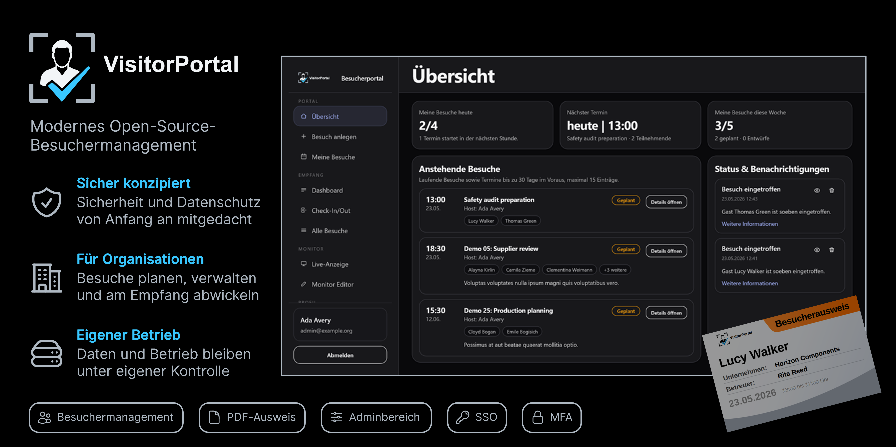

<p align="center">

</p>

# VisitorPortal

[English](README.md)

VisitorPortal ist ein webbasiertes Besuchermanagementsystem zum Voranmelden, Verwalten und Einchecken von Unternehmensbesuchern.

Das System unterstützt Besuchsvoranmeldung, Empfangsprozesse, druckbare Besucherausweise, einen Willkommensmonitor, Benachrichtigungen und rollenbasierte Berechtigungen.

## Projektstatus

VisitorPortal ist ein produktionsorientiertes Besuchermanagementsystem, das ursprünglich im Rahmen eines studentischen Teamprojekts entwickelt wurde. Die umgesetzten Kernprozesse sind funktionsfähig und können reale Besuchermanagement-Szenarien unterstützen, einschließlich Besuchsvoranmeldung, Empfangs-Check-in, Besucherausweisen, E-Mail-Benachrichtigungen, rollenbasierter Rechteverwaltung und Willkommensmonitor-Anzeigen.

Obwohl die umgesetzten Workflows für die praktische Nutzung ausgelegt sind, sollte das Projekt nicht ohne zusätzliche Sicherheits-, Datenschutz- und Betriebsprüfung in einer realen Organisation eingesetzt werden.
Die Anwendung verarbeitet potenziell personenbezogene Daten wie Namen, Unternehmen, Kontaktdaten, Besuchszeiten und Check-in-/Check-out-Zeitpunkte. Vor einem realen Einsatz müssen rechtliche Anforderungen, Aufbewahrungsfristen, Zugriffsschutz, Logging, Backups und Deployment-Sicherheit geprüft werden.

## Funktionen

- Besuchsvoranmeldung und Besuchsverwaltung
- Empfangs-Dashboard für Tagesbesuche
- Check-in und Check-out von Besuchern
- Druckbare Besucherausweise als PDF
- Check-In/Out-Übersicht für den Empfang
- Willkommensmonitor für geplante Besucher
- Rollenbasierte Rechteverwaltung mit eigenen Berechtigungen
- Optionale MFA für Nutzer und verpflichtende MFA für privilegierte Admin-Rollen
- Optionales generisches OpenID-Connect-SSO für Enterprise-Identity-Provider
- Adminbereich für Benutzer, Abteilungen, Rollen, Rechte, Besucher, Besuche, Monitore und Monitorseiten
- Benachrichtigungen für Gastgeber per E-Mail und in der Anwendung
- Queue- und Scheduler-Unterstützung für Hintergrundaufgaben
- Light, Dark, System und True Black Theme
- White-Label-Branding per Umgebungsvariablen
- Docker-basiertes Demo-Setup mit fertigem App-Image

## Organisations- und Standortmodell

VisitorPortal ist für eine Organisation pro Instanz gedacht. Mehrere Standorte innerhalb dieser Organisation werden unterstützt. Für rechtlich getrennte Organisationen sollten getrennte Instanzen betrieben werden, solange keine vollständige Multi-Tenancy explizit implementiert und auditiert wurde.

Standorte bilden physische Orte wie Empfänge, Werke, Büros oder Gebäude ab. Besuche, Monitore, Empfangsansichten und Host-/Vertretungsauswahl werden nach Standort begrenzt, damit ein Empfang nicht automatisch operative Daten anderer Standorte sieht.

Besucher-Stammdaten sind organisationsweite Kontakte. Die Standortisolation gilt für Besuche, Monitore, operative Sichtbarkeit und Host-/Vertretungszuordnungen, nicht für den Besucher-Kontaktdatensatz selbst.

## Tech Stack

- PHP 8.4
- Laravel 12
- Laravel Livewire
- MariaDB 11.4 als Standard (`pdo_mysql`-Treiber)
- Blade
- Tailwind CSS 4
- daisyUI 5
- Alpine.js
- Node.js 24 für Frontend-Build-Tools
- Filament 5
- Spatie Laravel Permission
- Filament Shield
- Spatie Laravel PDF
- Gotenberg 8.32 für PDF-Erzeugung
- Mailhog für lokale und Demo-E-Mail-Tests
- Docker und Docker Compose v2
- GitHub Actions

## Welches ZIP soll ich herunterladen?

- `VisitorPortal-demo-vX.Y.Z.zip`: für eine schnelle lokale Demo mit Docker und den mitgelieferten Startskripten.
- `besucherportal-vX.Y.Z.zip`: für Source-Code-Review oder source-basierte Deployments.
- GitHubs automatisch erzeugte `Source code`-Archive: nur verwenden, wenn ausdrücklich der rohe Repository-Snapshot benötigt wird.

Demo-Zugangsdaten und Demo-Seed-Daten dürfen nicht in Produktion verwendet werden. Weitere Details stehen in [Release Artifacts](docs/release-artifacts.md).

## Schnellstart: Demo-Setup

Das Demo-Setup ist für nicht-technische Nutzer gedacht. Es nutzt ein fertiges Docker-Image, daher müssen PHP, Composer, npm und Frontend-Build-Tools nicht lokal installiert sein.

Voraussetzung:

- Aktuelles Docker Desktop oder Docker Engine mit Docker Compose v2

Demo unter Windows starten:

```bat
start.bat
```

Demo unter macOS/Linux starten:

```bash
sh start.sh
```

Nach dem Start:

- Anwendung: [http://localhost:8080](http://localhost:8080)
- Mailhog: [http://localhost:8025](http://localhost:8025)

Beim ersten Start erstellt das Skript eine lokale `.env.demo` aus `.env.demo.example`. Falls die Ports belegt sind, können `APP_PORT` und `MAILHOG_PORT` in `.env.demo` angepasst werden.

Demo stoppen:

```bash
sh stop.sh
```

Demo-Daten zurücksetzen:

```bash
sh reset-demo.sh
```

Demo-Image aktualisieren:

```bash
sh update.sh
```

Windows-Nutzer können jeweils die passenden `.bat`-Skripte verwenden.

Im Source-Repository enthält `.env.demo.example` den Platzhalter `RELEASE_VERSION_PLACEHOLDER`. Offizielle Release-ZIPs ersetzen diesen Platzhalter durch den veröffentlichten Release-Tag, damit Demos reproduzierbar bleiben:

```env
VISITORPORTAL_VERSION=v1.0.2
```

## Demo-Zugangsdaten

Alle Demo-Accounts verwenden dasselbe Passwort: `ChangeMe-42!`

| Rolle | E-Mail | Passwort |
| --- | --- | --- |
| Admin | `admin@example.org` | `ChangeMe-42!` |
| Empfang | `reception@example.org` | `ChangeMe-42!` |
| Mitarbeitende | `employee@example.org` | `ChangeMe-42!` |
| Manager | `manager@example.org` | `ChangeMe-42!` |
| Willkommensmonitor | `welcome@example.org` | `ChangeMe-42!` |
| Security/Empfang | `security@example.org` | `ChangeMe-42!` |

Die Seeder erzeugen zusätzlich 20 englische Faker-Benutzer, 50 englische Faker-Besucher und 50 bis 100 Demo-Besuche. Demo-E-Mails verwenden ausschließlich reservierte `example.org`-, `example.com`- oder `example.net`-Domains. Telefonnummern sind entweder leer oder eindeutig fiktive E.164-Nummern aus reservierten Medien-/Demo-Bereichen. Demo-Seeding ist in `APP_ENV=production` blockiert.

## Entwickler-Setup

Das Entwickler-Setup nutzt das source-mounted `docker-compose.yml`.

```bash
cp backend/.env.example backend/.env
docker compose run --rm web composer install
docker compose up -d --build
docker compose exec web php artisan key:generate
docker compose exec web php artisan migrate:fresh --seed
```

Anwendung:

- [http://localhost:8080](http://localhost:8080)

Vite Dev Server:

- [http://localhost:5173](http://localhost:5173)

Weitere Details stehen in [docs/setup.md](docs/setup.md). Hinweise zu Betrieb, Monitoring und Healthchecks stehen in [docs/operations.md](docs/operations.md).

## Tests und Qualität

Tests im Entwicklungscontainer ausführen:

```bash
docker compose exec web php artisan test
```

Einzelne Tests ausführen:

```bash
docker compose exec web php artisan test tests/Feature/Receptionist/ReceptionAdministerVisitTest.php
```

Laravel Pint Style-Check:

```bash
docker compose exec web ./vendor/bin/pint --test -v
```

Frontend-Assets bauen:

```bash
docker compose run --rm node npm run build
```

Der GitHub-Actions-Workflow richtet PHP ein, führt Pint aus, migriert die Datenbank und startet die Tests gegen MariaDB.

## Konfiguration und White Labeling

VisitorPortal nutzt eine zentrale Branding-Konfiguration in `backend/config/branding.php`.

### Single Sign-On

VisitorPortal kann für generisches OpenID-Connect-SSO konfiguriert werden. Die Implementierung ist providerunabhängig und für Enterprise-Identity-Provider wie Microsoft Entra ID, Keycloak, Authentik, Okta und andere OIDC-kompatible Systeme gedacht.

SSO ist standardmäßig deaktiviert. Lokale Authentifizierung bleibt verfügbar, außer `AUTH_MODE=sso_only` wird gesetzt. In `sso_only` ist lokaler Login nur für Break-glass-Konten mit der Permission `LoginLocallyInSsoOnlyMode` erlaubt.

Wichtige Umgebungsvariablen:

- `BRANDING_NAME`
- `BRANDING_LOGO_LIGHT`
- `BRANDING_LOGO_DARK`
- `BRANDING_MAIL_LOGO`
- `BRANDING_BADGE_LOGO`
- `BRANDING_BADGE_DESIGN` (`standard` oder `photo_qr`)
- `BRANDING_BADGE_ACCENT_COLOR`
- `BRANDING_MONITOR_FALLBACK_HEADING`
- `BRANDING_MONITOR_FALLBACK_SUBHEADING`
- `BRANDING_MONITOR_SLIDE_HEADING`

Die Standard-Assets liegen in `backend/public/images/branding/`.

Für produktionsnahe Deployments müssen insbesondere diese Demo-Defaults geprüft werden:

- `APP_DEBUG`
- `APP_KEY`
- Datenbank-Zugangsdaten
- Mail-Einstellungen
- `AUTO_MIGRATE`
- `AUTO_SEED`
- `FORCE_SEED`
- `APP_URL`
- HTTPS-/Reverse-Proxy-Konfiguration

## Projektstruktur

- `backend/app/` - Laravel-Anwendungscode
- `backend/app/Livewire/` - Livewire-Komponenten
- `backend/app/Filament/` - Filament-Adminressourcen
- `backend/resources/views/` - Blade Views und UI-Partials
- `backend/resources/css/` - Tailwind/daisyUI-Einstieg und Themes
- `backend/database/migrations/` - Datenbankschema
- `backend/database/seeders/` - Demo- und Setup-Seeders
- `backend/public/images/branding/` - Standard-Branding-Assets
- `docker/` - Docker-Image und Apache/PHP-Konfiguration
- `docker-compose.yml` - source-mounted Entwicklungssetup
- `docker-compose.demo.yml` - Demo-Setup mit fertigem Image
- `.github/workflows/` - CI und Image-Build-Workflows
- `docs/` - englische Release-, Setup-, Deployment- und Betriebsdokumentation

## Dokumentation

- [Setup Guide](docs/setup.md)
- [Release Artifacts](docs/release-artifacts.md)
- [Configuration](docs/configuration.md)
- [Deployment](docs/deployment.md)
- [Go-Live Checklist](docs/go-live-checklist.md)
- [Betrieb und Monitoring](docs/operations.md)
- [Roles and Permissions](docs/roles.md)
- [Queue](docs/queue.md)
- [Scheduler](docs/scheduler.md)
- [Welcome Monitor](docs/welcome_monitor.md)
- [Security Hardening](docs/security-hardening.md)
- [Single Sign-On](docs/sso.md)
- [Known Limitations](docs/known-limitations.md)

## Roadmap

Mögliche nächste Schritte:

- Self-Check-in-Workflow ergänzen
- Export- und Reporting-Funktionen ergänzen, zum Beispiel CSV, Kalendertermine oder Kontaktexporte
- Vollständiges Activity Logging in der Datenbank ergänzen, zusätzlich zu technischen Datei-Logs
- Autorisierung und Sicherheitsprüfungen weiter härten
- Testabdeckung für Edge Cases und Browser-Interaktionen verbessern
- Screenshots und visuelle Feature-Dokumentation ergänzen

## Sicherheit

Bitte [SECURITY.md](SECURITY.md) lesen, bevor Sicherheitslücken gemeldet werden oder VisitorPortal in einer Umgebung mit echten Besucherdaten eingesetzt wird.

Sensible Sicherheitsprobleme bitte nicht über öffentliche GitHub-Issues melden.

## Mitwirken

Beiträge sind willkommen. Bitte [CONTRIBUTING.md](CONTRIBUTING.md) lesen, bevor größere Pull Requests geöffnet werden.

## Lizenz

Copyright (C) 2026 Jonathan Läpple and VisitorPortal contributors.

VisitorPortal ist unter der GNU General Public License v3.0 oder später lizenziert. Siehe [LICENSE](LICENSE).

## Autoren und Credits

Dieses Projekt entstand ursprünglich im Rahmen eines studentischen Hochschulprojekts. Nach Abschluss der ursprünglichen Projektarbeit wurden die Weiterentwicklung, Bereinigung und technische Verbesserung des Projekts fortgeführt.

### Ursprüngliches Projektteam

Die folgenden Personen sind die ursprünglichen Autorinnen und Autoren aus dem initialen studentischen Projektteam. Spätere Beiträge werden über die Projekthistorie und die jeweiligen Contributions nachvollzogen.

- **Jonathan Läpple** - Projektleitung und Entwicklung
- **Jannik Schabel** - Entwicklung
- **Jan Wangerin** - Entwicklung
- **Lena Berger** - Entwicklung
- **Peter Claaß** - Entwicklung

Vielen Dank an alle Mitwirkenden für ihre Beiträge zu Konzeption, Umsetzung, Testing, Dokumentation und Feedback.
