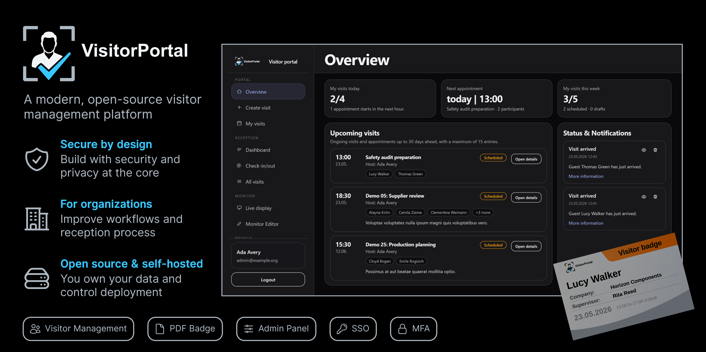

<p align="center">

</p>

# VisitorPortal

[Deutsch](README.de.md)

VisitorPortal is a web-based visitor management system for registering, managing and checking in company visitors.

It supports visitor pre-registration, reception workflows, printable visitor badges, a welcome monitor, notifications, and role-based access control.

## Project Status

VisitorPortal is a production-oriented visitor management system first developed as part of a student team project. Its implemented core workflows are functional and can support real-world visitor management scenarios, including visit registration, reception check-in, visitor badges, email notifications, role-based access control, and welcome monitor displays.

Although the implemented workflows are designed to be usable in practice, the project should not be deployed in a real organization without an additional security, privacy, and operational review.
The application processes potentially personal data such as visitor names, companies, contact details, visit times, and check-in/check-out timestamps. Before using it in a real organization, review legal requirements, retention policies, access control, logging, backups, and deployment security.

## Features

- Visitor pre-registration and visit management
- **Multi-tier visitor workflow**: Director's Executive Reception tier, standard reception, and finance cheque service
- **Public booking wizard**: Self-service appointment scheduling with approval gates, digital signatures, and cheque capture for finance transactions
- **Approval workflow**: Department-level approval gates with rejection handling and reason tracking
- **Finance cheque service**: Digitally signed cheque submission with pick-up/drop-off workflows
- **Multi-receptionist support**: Dedicated reception staff per department with targeted check-in notifications
- **Ushering workflow**: Receptionist-to-department host hand-off tracking
- Reception dashboard for daily visits with approval and ushering status
- Visitor check-in and check-out
- Printable visitor badges as PDFs
- Check-in/out overview for reception desks
- Welcome monitor for scheduled visitors
- Role-based access control with custom permissions
- Optional MFA for users and required MFA for privileged admin roles
- Optional generic OpenID Connect SSO for enterprise identity providers
- Admin panel for users, departments, roles, permissions, visitors, visits, monitors, and monitor slides
- Host notifications by email and in-app notifications
- **Receptionist notifications**: Check-in alerts routed to designated department receptionists
- Queue and scheduler support for background tasks
- Light, dark, system, and true black themes
- White-label branding via environment configuration
- Docker-based demo setup with prebuilt application image

## Organization and Site Model

VisitorPortal is designed for one organization per instance.
Multiple sites/locations within one organization are supported.
For legally separate organizations, run separate instances unless full multi-tenancy is explicitly implemented and audited.

Sites represent physical locations such as receptions, plants, offices, or buildings. Visits, monitors, reception views, and host/substitute selections are scoped by site so one reception desk does not automatically see operational data from another location.

Visitor master records are organization-wide contacts. Site isolation applies to visits, monitors, operational visibility, and host/substitute assignments, not to the visitor contact record itself.

## Tech Stack

- PHP 8.4
- Laravel 12
- Laravel Livewire
- MariaDB 11.4 by default (`pdo_mysql` driver)
- Blade
- Tailwind CSS 4
- daisyUI 5
- Alpine.js
- Node.js 24 for frontend build tooling
- Filament 5
- Spatie Laravel Permission
- Filament Shield
- Spatie Laravel PDF
- Gotenberg 8.32 for PDF generation
- Mailhog for local/demo email testing
- Docker and Docker Compose v2
- GitHub Actions

## Which ZIP Should I Download?

- `VisitorPortal-demo-vX.Y.Z.zip`: use this for a quick local demo with Docker and the bundled start scripts.
- `besucherportal-vX.Y.Z.zip`: use this for source-based review or deployment work.
- GitHub's auto-generated `Source code` archives: use only when you specifically want the raw repository snapshot.

Do not use demo credentials or demo seed data in production. See [Release Artifacts](docs/release-artifacts.md) for details.

## Quick Start: Demo Setup

The demo setup is intended for non-technical users. It uses a prebuilt Docker image, so PHP, Composer, npm, and frontend build tools are not required on the host machine.

Requirements:

- Current Docker Desktop or Docker Engine with Docker Compose v2

Start the demo on Windows:

```bat
start.bat
```

Start the demo on macOS/Linux:

```bash
sh start.sh
```

After startup:

- Application: [http://localhost:8080](http://localhost:8080)
- Mailhog: [http://localhost:8025](http://localhost:8025)

On first start, the script creates a local `.env.demo` from `.env.demo.example`. If these ports are already in use, adjust `APP_PORT` and `MAILHOG_PORT` in `.env.demo`.

Stop the demo:

```bash
sh stop.sh
```

Reset demo data:

```bash
sh reset-demo.sh
```

Update the demo image:

```bash
sh update.sh
```

Windows users can use the matching `.bat` scripts.

In the source repository, `.env.demo.example` contains `RELEASE_VERSION_PLACEHOLDER`. Official release ZIPs replace that placeholder with the published release tag so demos are reproducible:

```env
VISITORPORTAL_VERSION=v1.0.2
```

## Demo Accounts

All demo accounts use the same password: `ChangeMe-42!`

| Role | Email | Password |
| --- | --- | --- |
| Admin | `admin@example.org` | `ChangeMe-42!` |
| Reception | `reception@example.org` | `ChangeMe-42!` |
| Employee | `employee@example.org` | `ChangeMe-42!` |
| Manager | `manager@example.org` | `ChangeMe-42!` |
| Welcome monitor | `welcome@example.org` | `ChangeMe-42!` |
| Security/reception | `security@example.org` | `ChangeMe-42!` |

The seeders also create 20 additional Faker-based users, 50 additional Faker-based visitors, and 50 to 100 demo visits. Demo email addresses use reserved `example.org`, `example.com`, or `example.net` domains. Demo phone numbers use reserved media/demo number ranges in E.164 format or are intentionally blank. Demo seeders are blocked in `APP_ENV=production`.

## Development Setup

The developer setup uses the source-mounted `docker-compose.yml`.

```bash
cp backend/.env.example backend/.env
docker compose run --rm web composer install
docker compose up -d --build
docker compose exec web php artisan key:generate
docker compose exec web php artisan migrate:fresh --seed
```

Application:

- [http://localhost:8080](http://localhost:8080)

Vite development server:

- [http://localhost:5173](http://localhost:5173)

More setup details are documented in [docs/setup.md](docs/setup.md). Operational monitoring and health checks are documented in [docs/operations.md](docs/operations.md).

## Tests and Quality Checks

Run the test suite inside the development container:

```bash
docker compose exec web php artisan test
```

Run a targeted test file:

```bash
docker compose exec web php artisan test tests/Feature/Receptionist/ReceptionAdministerVisitTest.php
```

Run Laravel Pint style checks:

```bash
docker compose exec web ./vendor/bin/pint --test -v
```

Build frontend assets:

```bash
docker compose run --rm node npm run build
```

The GitHub Actions workflow runs PHP setup, Pint, migrations, and tests against MariaDB.

## Configuration and White Labeling

VisitorPortal has a central branding configuration in `backend/config/branding.php`.

### Single Sign-On

VisitorPortal can be configured for generic OpenID Connect SSO. The implementation is provider-independent and is intended for enterprise identity providers such as Microsoft Entra ID, Keycloak, Authentik, Okta and other OIDC-compatible systems.

SSO is disabled by default. Local authentication remains available unless `AUTH_MODE=sso_only` is configured. In `sso_only`, local login is reserved for break-glass accounts with the `LoginLocallyInSsoOnlyMode` permission.

Common environment variables:

- `BRANDING_NAME`
- `BRANDING_LOGO_LIGHT`
- `BRANDING_LOGO_DARK`
- `BRANDING_MAIL_LOGO`
- `BRANDING_BADGE_LOGO`
- `BRANDING_BADGE_DESIGN` (`standard` or `photo_qr`)
- `BRANDING_BADGE_ACCENT_COLOR`
- `BRANDING_MONITOR_FALLBACK_HEADING`
- `BRANDING_MONITOR_FALLBACK_SUBHEADING`
- `BRANDING_MONITOR_SLIDE_HEADING`

The default assets are stored in `backend/public/images/branding/`.

For production-like deployments, explicitly review these demo defaults:

- `APP_DEBUG`
- `APP_KEY`
- database credentials
- mail settings
- `AUTO_MIGRATE`
- `AUTO_SEED`
- `FORCE_SEED`
- `APP_URL`
- HTTPS/reverse proxy configuration

## Project Structure

- `backend/app/` - Laravel application code
- `backend/app/Livewire/` - Livewire components
- `backend/app/Filament/` - Filament admin resources
- `backend/resources/views/` - Blade views and UI partials
- `backend/resources/css/` - Tailwind/daisyUI entrypoint and themes
- `backend/database/migrations/` - database schema
- `backend/database/seeders/` - demo and setup seeders
- `backend/public/images/branding/` - default branding assets
- `docker/` - application Docker image and Apache/PHP configuration
- `docker-compose.yml` - source-mounted development setup
- `docker-compose.demo.yml` - prebuilt-image demo setup
- `.github/workflows/` - CI and image build workflows
- `docs/` - release, setup, deployment and operations documentation

## Documentation

- [Setup Guide](docs/setup.md)
- [Release Artifacts](docs/release-artifacts.md)
- [Configuration](docs/configuration.md)
- [Deployment](docs/deployment.md)
- [Go-Live Checklist](docs/go-live-checklist.md)
- [Monitoring and Operations](docs/operations.md)
- [Roles and Permissions](docs/roles.md)
- [Queue](docs/queue.md)
- [Scheduler](docs/scheduler.md)
- [Welcome Monitor](docs/welcome_monitor.md)
- [Security Hardening](docs/security-hardening.md)
- [Single Sign-On](docs/sso.md)
- [Known Limitations](docs/known-limitations.md)

## Roadmap

Recent additions (v2.0):
- ✅ Multi-tier visitor workflow with approval gates and ushering
- ✅ Public self-service booking wizard with signature capture
- ✅ Finance cheque service with digital signatures and pick-up/drop-off tracking
- ✅ Dedicated receptionist assignments per department
- ✅ Multi-receptionist check-in notifications
- ✅ Comprehensive English localization

Possible next steps:

- Add a self-check-in workflow
- Add export and reporting features, for example CSV, calendar events, or contact exports
- Add full activity logging in the database, beyond technical file logs
- Harden authorization and security checks further
- Improve automated test coverage for edge cases and browser-level interactions
- Add screenshots and visual feature documentation

## Security

Please read [SECURITY.md](SECURITY.md) before reporting vulnerabilities or deploying VisitorPortal in an environment with real visitor data.

Do not report sensitive security issues through public GitHub issues.

## Contributing

Contributions are welcome. Please read [CONTRIBUTING.md](CONTRIBUTING.md) before opening larger pull requests.

## License

Copyright (C) 2026 Jonathan Läpple and VisitorPortal contributors.

This project is licensed under the GNU General Public License v3.0 or later. See [LICENSE](LICENSE).

## Authors and Credits

The project was created collaboratively as part of an initial student project phase at university.
Further development, cleanup, and technical improvements continued after the original project work.

### Initial Project Authors

The following people are the initial project authors from the original student project team. Later contributors are acknowledged through the project history and their contributions.

- **Jonathan Läpple** – Project Lead and Developer
- **Jannik Schabel** – Developer
- **Jan Wangerin** – Developer
- **Lena Berger** – Developer
- **Peter Claaß** – Developer

We would like to thank all contributors for their work on concept development, implementation, testing, documentation, and feedback.
