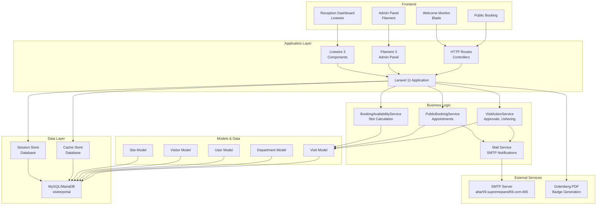
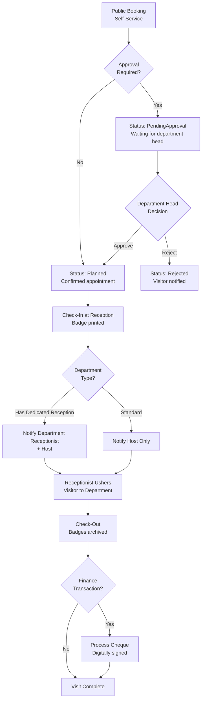
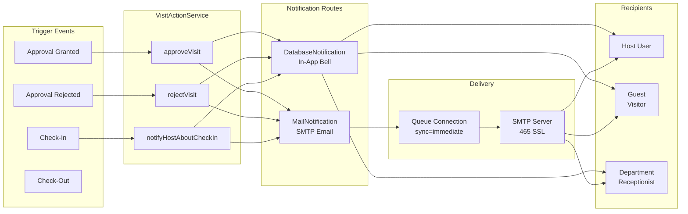
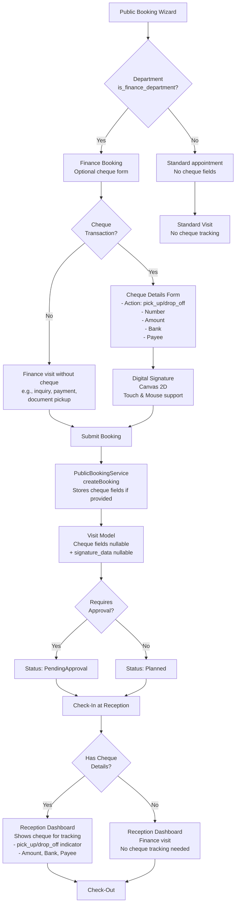
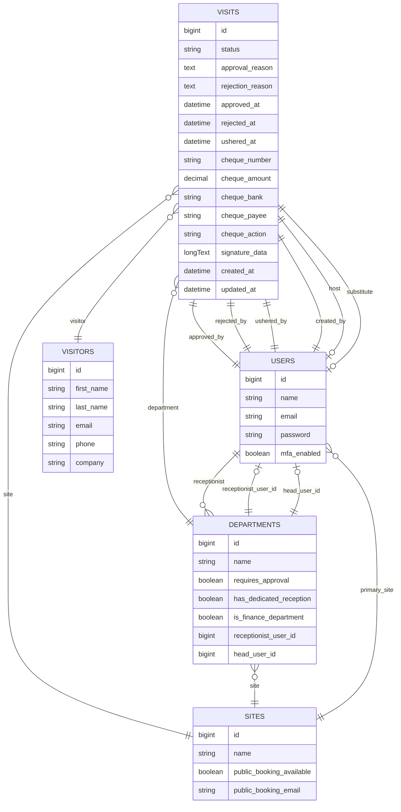
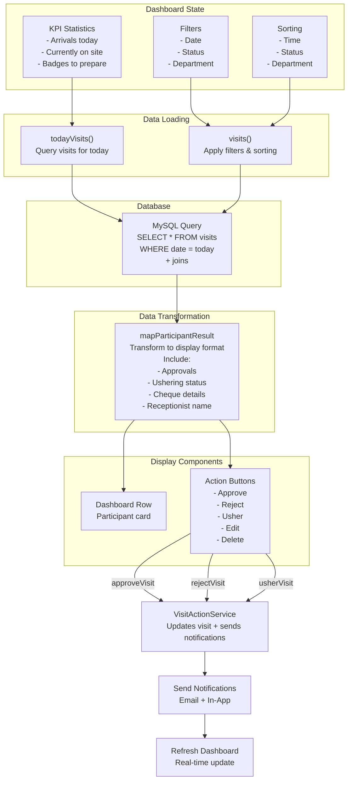
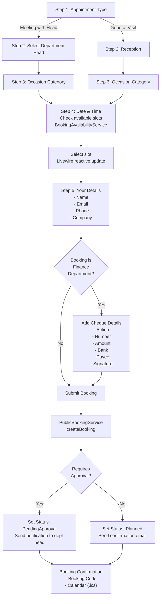
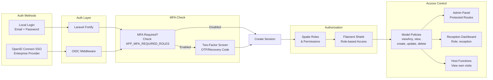

# VisitorPortal Architecture Diagrams

Comprehensive system architecture and workflow diagrams for VisitorPortal's multi-tier visitor management system.

## 1. System Architecture

## 2. Visitor Workflow - Multi-Tier System

## 3. Notification Flow

## 4. Finance Cheque Service Workflow

## 5. Database Schema - Key Entities

## 6. Reception Dashboard Data Flow

## 7. Public Booking Wizard - Step Flow

## 8. Authentication & Authorization Flow

---

## Architecture Principles

### Multi-Tier Visitor Workflow
- **Public Self-Service**: Booking via public wizard with optional approval gates
- **Department Approval**: Optional approval workflow with rejection handling
- **Receptionist Routing**: Dedicated receptionists can receive targeted check-in notifications
- **Finance Service**: Specialized workflow for cheque transactions with digital signatures
- **Ushering**: Department receptionists hand off visitors with tracking

### Notification System
- **Real-time**: Queue connection set to `sync` for instant delivery
- **Multi-channel**: Database notifications (in-app bell) + email via SMTP
- **Smart Routing**: Notifications route to host, guest, and/or receptionist based on department settings

### Database Design
- **Relational**: Foreign keys link visits to users, departments, sites, and visitors
- **Audit Trail**: `created_at`, `approved_at`, `rejected_at`, `ushered_at` timestamps
- **Extensible**: Cheque fields stored on visit for finance workflows
- **Digital Signature**: `signature_data` stored as base64 for compliance

### Security & Access Control
- **Role-Based**: Spatie permissions + Filament Shield
- **Model Policies**: Fine-grained authorization per resource
- **MFA Support**: Optional for users, required for privileged roles
- **Session Isolation**: Database sessions with 120-minute TTL

